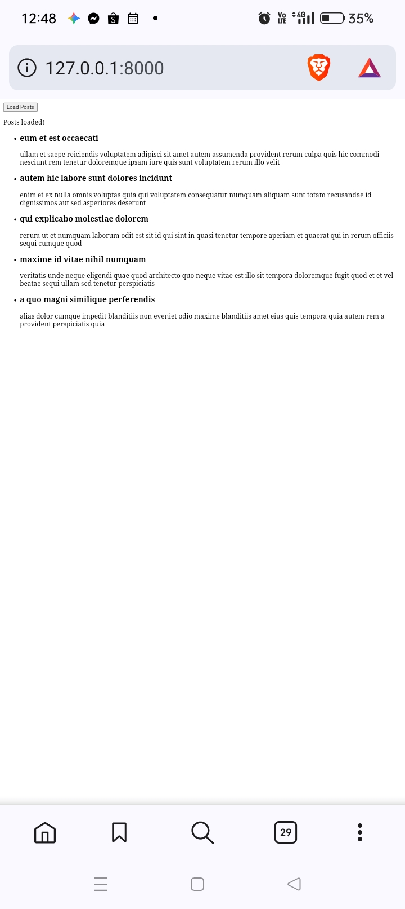
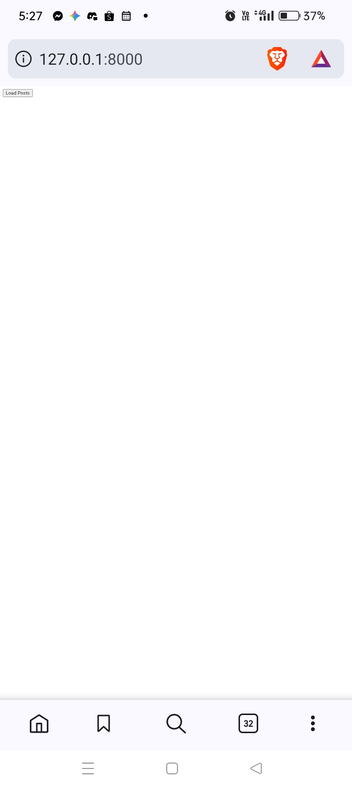
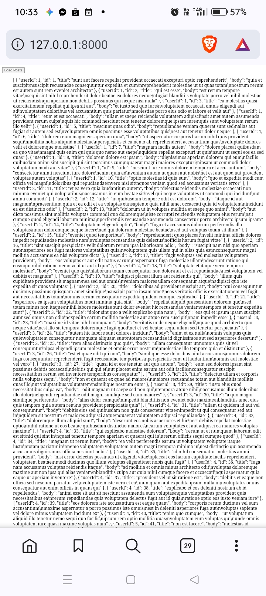
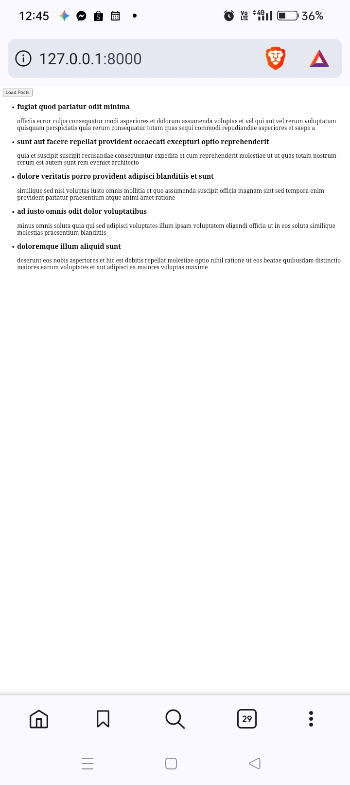
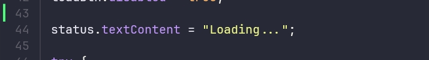
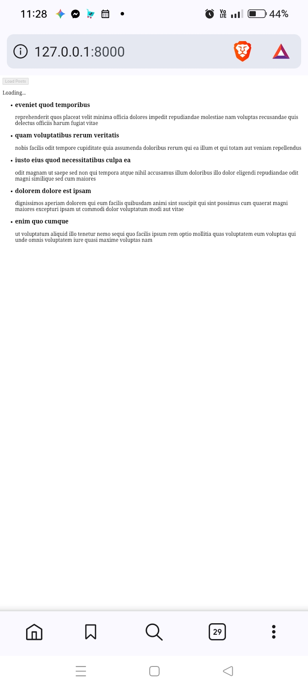
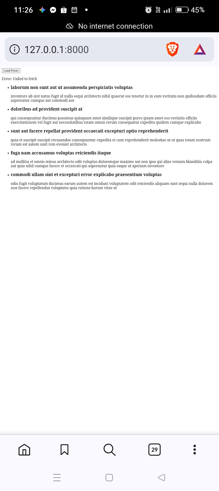
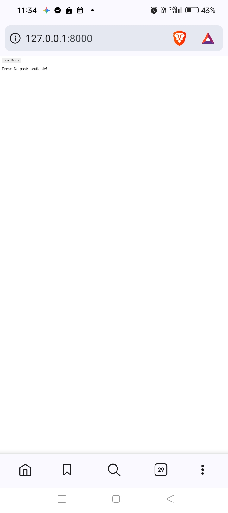

# Build a Dynamic Post Explorer

  

This simple web application uses HTML, CSS, and JavaScript to fetch blog posts from JSONPlaceholder and display them on the page without reloading the browser.

---

## Activity Goal

The goal is to load blog posts dynamically using JavaScript so the user never has to refresh their browser to view updated content.

| Visual Evidence | How It Meets the Goal |
| :---: | :--- |
|  | Displays dynamic blog posts instantly without triggering a browser refresh. |

---

## Key Features and Visual Breakdown

This table summarizes each required feature alongside its completion status and corresponding visual output.

| Feature Number | Required Feature | Screenshot Visual | Status |
| :---: | :--- | :---: | :---: |
| **01** | **Load Button:** A button that starts fetching blog posts when clicked. |  | Complete |
| **02** | **Modern Request Code:** Clean code that waits for network responses smoothly. |  | Complete |
| **03** | **First 5 Posts Limit:** Slices the network response to show only the first 5 posts. |  | Complete |
| **04** | **Safe Text Display:** Displays post titles and content safely to prevent malicious code injection. |  | Complete |
| **05** | **Loading Status:** Shows a loading message or spinner while waiting for data. |  | Complete |
| **06** | **Error Handling:** Displays a clear warning if the internet fails or an error occurs. |  | Complete |
| **07** | **Retry Option:** Gives users a way to try fetching the data again if it fails. |  | Complete |
| **08** | **No Page Refresh:** Updates the display smoothly without resetting the whole page. |  | Complete |

---

## Step-by-Step Development Guide

### Step 1: Create the Web Page Layout
The basic layout is built using HTML, creating a trigger button and a container box for incoming post cards.

---

### Step 2: Write the Data Fetching Code
JavaScript code is implemented to send requests across the network to retrieve post data when triggered.

---

### Step 3: Show Data on the Screen and Basic Errors
Retrieved post data is safely displayed on the page, alongside basic UI states for empty API responses.

| Data Display Success | Empty Response Message |
| :---: | :---: |
|  |  |

---

### Step 4: Add Loading and Disabled States
The button is temporarily disabled during network requests while displaying a loading indicator to prevent repeat clicks.

| Loading Screen | Data Successfully Loaded |
| :---: | :---: |
|  |  |

---

### Step 5: Handle Internet Failures and Unexpected Errors
Error handling manages network drops and empty responses by presenting helpful error messages to the user.

| Offline Error Message | Empty Data Warning |
| :---: | :---: |
|  |  |

---

## Testing Matrix

This table shows how the application behaves under various network conditions and test actions.

| Action Tested | What Should Happen | Visual Result |
| :--- | :--- | :---: |
| **Clicking the button once** | Downloads post data and displays 5 posts smoothly. |  |
| **Clicking multiple times rapidly** | Disables the button immediately to block repeat requests. |  |
| **Simulating a slow internet connection** | Shows a clear loading state until the network responds. |  |
| **Simulating no internet connection** | Catches the error and asks the user to check their connection. |  |
| **Simulating an empty list of posts** | Displays a message letting the user know no posts were found. |  |

Thanks be to God!
